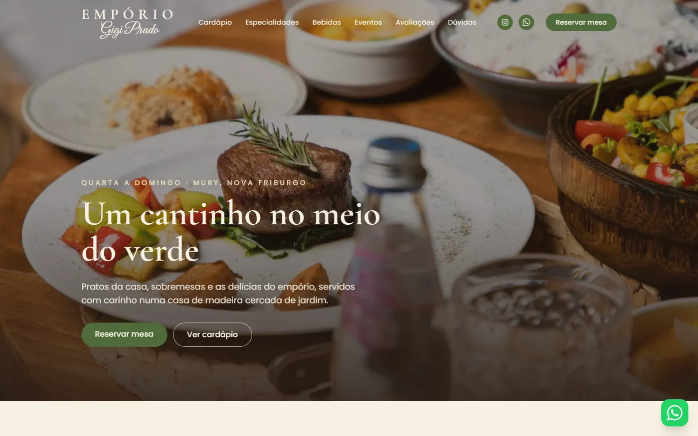
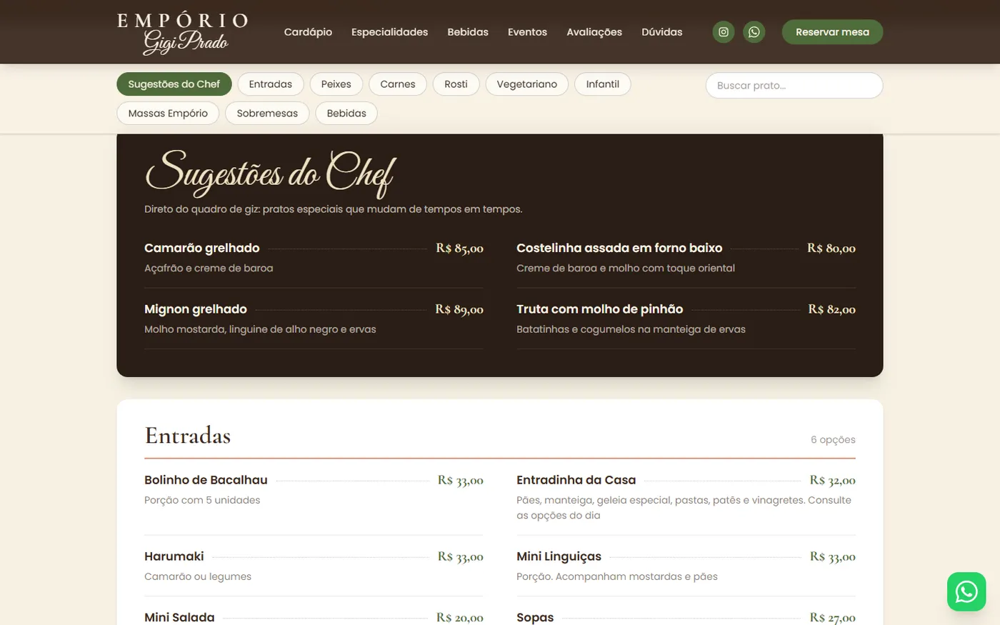
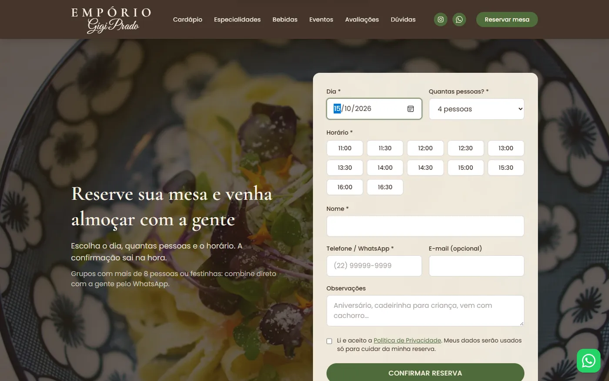
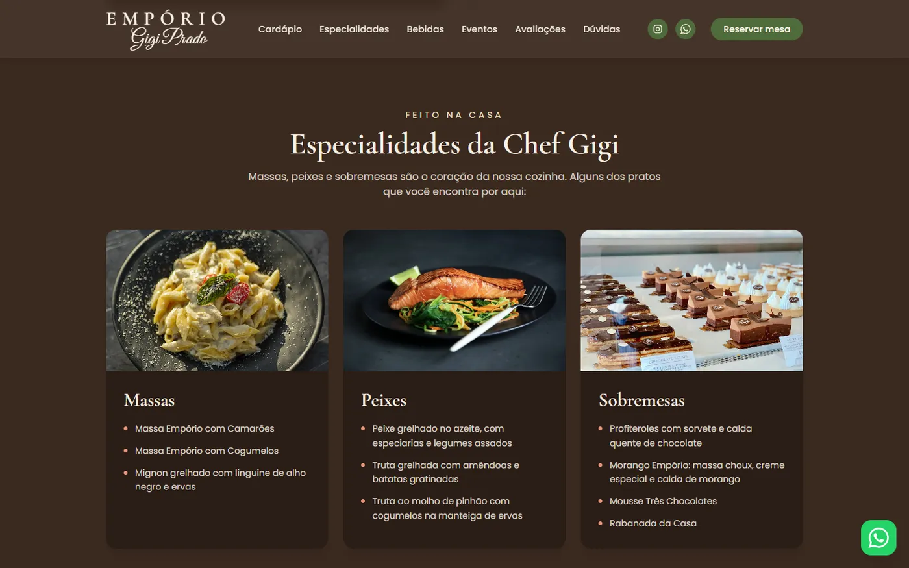
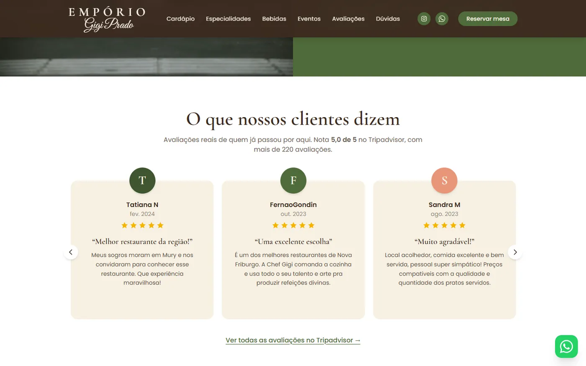
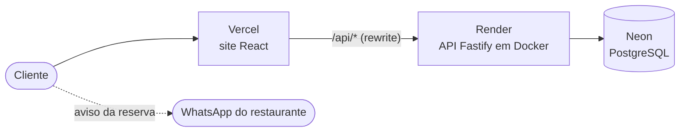

<div align="center">

# 🌿 Empório Gigi Prado

**Site e sistema de reservas de um restaurante de verdade, em Nova Friburgo (RJ)**

[](https://github.com/pedro-augusto-xavier/TRABALHO-RESTAURANTE-GIGI-/actions/workflows/ci.yml)


### [🔗 emporio-gigi-prado.vercel.app](https://emporio-gigi-prado.vercel.app)



</div>

## Sobre

O Empório Gigi Prado é um restaurante e empório numa casa de madeira cercada de jardim, em Mury, Nova Friburgo,
com nota 5,0 no Tripadvisor. Fiz este sistema para ele: um site para os clientes conhecerem a casa, verem o
cardápio e **reservarem mesa online com confirmação na hora**, e uma API com as regras do negócio por trás.

O projeto foi pensado para a rotina real da casa. A dona cozinha e não tem tempo de ficar olhando um painel,
então a reserva se confirma sozinha e chega no WhatsApp dela.

## Funcionalidades

- **Reserva online:** o cliente escolhe dia e número de pessoas, vê só os horários com lugar e recebe um código na
  hora. Grupos com mais de 8 pessoas são encaminhados para o WhatsApp.
- **Cardápio em três abas (Almoço, Café e lanches, Bebidas):** 64 itens na ordem do cardápio impresso, busca em
  todas as abas ignorando acentos, preço em reais ou "Consulte" e barra de categorias que acompanha a rolagem.
  Cada aba tem link próprio (`/cardapio?aba=cafe`).
- **Página inicial:** especialidades da chef, bebidas, eventos e música ao vivo, galeria, avaliações reais do
  Tripadvisor, perguntas frequentes e mapa.
- **LGPD:** consentimento explícito, política de privacidade e, na API, exportação e exclusão (anonimização) dos
  dados do titular.
- **Responsivo e acessível:** funciona do celular ao desktop, todas as imagens têm descrição e as animações
  respeitam a opção de "reduzir movimento" do sistema.

## Telas

| Cardápio | Reserva |
|---|---|
|  |  |
| **Especialidades** | **Avaliações** |
|  |  |

<p align="center"></p>

## Tecnologias

| Parte | Ferramentas |
|---|---|
| **Site** | React 19, TypeScript, Vite, Tailwind CSS 4, React Router |
| **API** | Node.js, Fastify 5, TypeScript, Zod |
| **Banco** | PostgreSQL com Drizzle ORM e migrações versionadas |
| **Testes** | Vitest, Testing Library e PGlite (Postgres real rodando em memória) |
| **Infra** | Docker, GitHub Actions, Vercel (site), Render (API) e Neon (banco) |

## Arquitetura



O site repassa `/api/*` para a API pela própria Vercel. Para o navegador, site e API ficam no mesmo endereço,
então não há problema de CORS e o cookie de sessão pode ser `SameSite=Strict`.

## Destaques técnicos

- **Reserva por lotação, não por mesa.** As mesas da casa se juntam conforme o grupo, então a regra é "no máximo
  30 pessoas ao mesmo tempo". O cálculo considera o **pico de ocupação** durante toda a reserva, e não só o horário
  de chegada.
- **Sem reserva duplicada.** Um *advisory lock* do Postgres por dia impede que dois clientes peguem o último lugar
  ao mesmo tempo. Há um teste que dispara 5 reservas simultâneas e confere que só as que cabem passam.
- **Testes com banco de verdade, sem Docker.** Os testes de integração sobem um PostgreSQL em memória (PGlite) com
  as mesmas migrações de produção. Em desenvolvimento, a API também roda com esse banco embutido, então não é
  preciso instalar nada além do Node.
- **Segurança:** senhas com scrypt; access token curto e refresh token rotativo em cookie `httpOnly`, com
  **detecção de reuso** (um token roubado derruba todas as sessões); limite de tentativas no login; cabeçalhos de
  segurança e validação de toda entrada com Zod.
- **Cardápio como código.** O cardápio fica em [apps/api/src/menu/cardapio.ts](apps/api/src/menu/cardapio.ts).
  Ao subir, a API compara um hash do arquivo com o que está no banco e, se mudou, atualiza tudo numa transação.
  Mudar um preço é editar uma linha e dar push.
- **Regras no servidor:** o preço de um pedido sempre vem do banco, nunca do navegador, e os horários são
  calculados no fuso do restaurante, não no do celular do cliente.
- **LGPD de verdade:** o consentimento é gravado com a versão da política, há trilha de auditoria e a exclusão
  anonimiza os dados mantendo o histórico. Os detalhes estão em [docs/LGPD.md](docs/LGPD.md).

**91 testes automatizados** (65 na API e 26 no site) rodam a cada push no GitHub Actions, junto com a checagem de
tipos, o build e a construção da imagem Docker.

## Estrutura

```text
apps/
  api/            API Fastify
    src/modules/  auth, me (LGPD), menu, reservations, orders, tables
    src/db/       schema, migrações, seed
    drizzle/      migrações SQL geradas
    test/         testes de integração (PGlite) e de regras
  web/            site React
    src/pages/    páginas (início, cardápio, privacidade)
    src/components/ seções da página inicial
docs/             LGPD, deploy, identidade visual e prints
```

## Rodando no seu computador

Só precisa do **Node 22+**. Em desenvolvimento a API usa um PostgreSQL embutido, salvo em `apps/api/.data`.

```bash
npm install
cp .env.example .env          # já vem pronto para desenvolvimento
npm run db:seed -w apps/api   # cria o cardápio e um usuário admin
npm test                      # roda os 91 testes
```

Depois, em dois terminais:

```bash
npm run dev:api               # API em http://localhost:3333
npm run dev:web               # site em http://localhost:5173
```

Para zerar o banco de desenvolvimento, **pare a API**, apague `apps/api/.data` e rode o seed de novo.
O passo a passo de publicação está em [docs/DEPLOY.md](docs/DEPLOY.md).

<details>
<summary><strong>Rotas da API</strong></summary>

| Método | Rota | Quem |
|---|---|---|
| POST | `/api/auth/register` · `/login` · `/refresh` · `/logout` | público |
| GET/PATCH/DELETE | `/api/me` · GET `/api/me/export` · PUT `/api/me/consents` | logado |
| GET | `/api/menu` | público |
| GET | `/api/reservations/availability?date=AAAA-MM-DD&partySize=N` | público |
| POST | `/api/reservations` | público (com ou sem conta) |
| GET / POST | `/api/reservations/:code?phone=` · `/api/reservations/:code/cancel` | público (código + telefone) |
| GET | `/api/me/reservations` | logado |
| * | `/api/admin/menu/*` · `/api/admin/tables` | admin (atendente: só disponibilidade) |
| GET / PATCH | `/api/admin/reservations?date=` · `/:id/status` | admin, atendente |
| * | `/api/orders` · `/api/admin/orders` | pronto na API, desativado no site |

Regras de horário e lotação: [apps/api/src/config/restaurant.ts](apps/api/src/config/restaurant.ts).

</details>

## Próximos passos

- [ ] Reserva chegar automaticamente no celular da dona, sem depender do cliente apertar o botão
- [ ] Perfil no Google e domínio próprio
- [ ] Delivery: a API de pedidos já está pronta e testada, mas o restaurante decidiu não oferecer por enquanto

## Créditos

Desenvolvido por **Pedro Augusto Xavier Machado** ([GitHub](https://github.com/pedro-augusto-xavier)).

Código sob a [licença MIT](LICENSE). As fotos ilustrativas de pratos e bebidas são do [Unsplash](https://unsplash.com).
As fotos, o cardápio e a marca do Empório Gigi Prado pertencem ao restaurante.
